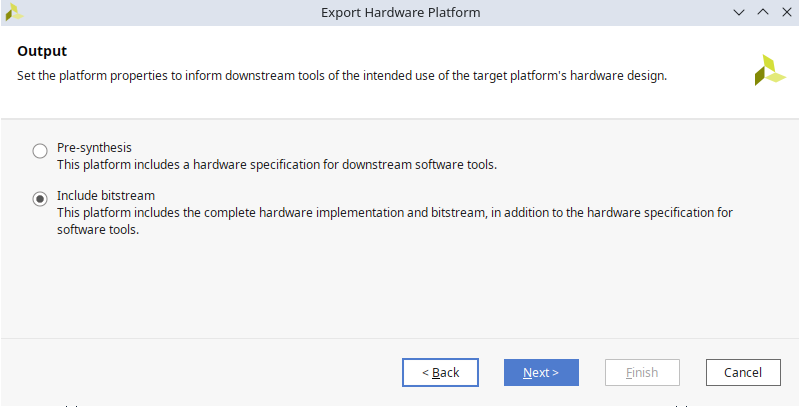

# ZYNQ Custom IP Development Guide: HDL Software integration with Vivado and Vitis

This guide demonstrates how to package your HDL (Verilog) code as an IP core, integrate it into a block design with a ZYNQ Processing System, and access it from software using AXI-lite and full AXI interfaces through an AXI BRAM Controller with Vivado and Vitis IDE.

This guide serves as a spiritual successor to my previous [HDL on PYNQ](https://github.com/vidvidex/HDL-on-PYNQ) tutorial.

**Hardware Requirements:** This tutorial uses a PYNQ-ZU board, but any ZYNQ-based board should work with minimal modifications.

**Software Requirements:** This guide was created using Vivado and Vitis IDE version 2023.1. The procedures should remain similar for other versions.

## Example HDL Code

For this tutorial, I'll be using my implementation of the [Falcon signature algorithm](https://falcon-sign.info/). While the complete code is still under development, the key component for this guide is the interface of the top module:

```verilog
module falcon#(
    parameter int N = 1024
  )(
    input logic clk,
    input logic rst_n,

    input logic start,
    input logic algorithm_select,

    output logic signature_accepted,
    output logic signature_rejected,

    input logic ext_bram_en, 
    input logic [19:0] ext_bram_addr,
    input logic [15:0] ext_bram_we,
    input logic[127:0] ext_bram_din, 
    output logic [127:0] ext_bram_dout 
  );
```

### Interface Overview

The module includes:

- **Parameter `N`**: Fixed to a specific value when instantiating the IP core
- **Clock and reset signals**: Standard clock and active-low reset
- **Control signals**: Four signals managing algorithm operation (`start`, `algorithm_select`, `signature_accepted`, `signature_rejected`)
- **BRAM interface**: Five signals enabling software access to internal BRAM

### Communication Interfaces

- **AXI-lite**: Used for control signals
- **Full AXI with AXI BRAM Controller**: Used for BRAM signals

Note: Your project may only require one of these interfaces. Simply follow the relevant sections of this guide for your specific needs.

## Creating an AXI-lite Wrapper

AXI-lite registers provide the most straightforward method for software-hardware communication. Software can write values to registers that are reflected in your HDL design, or read values that your HDL writes to registers.

The easiest approach to create an AXI-lite wrapper is using Vivado's built-in template. Unlike my [previous guide](https://github.com/vidvidex/HDL-on-PYNQ), where I created a new project with an AXI-lite wrapper, this tutorial takes the reverse approach: generating the wrapper code in a temporary project and copying it to your existing project.

### Generating Wrapper Code

1. Navigate to `Tools > Create and Package New IP` and click `Next` on the first page.

2. On the second page, select `Create a new AXI4-peripheral` and click `Next`.


3. Since this is a temporary project solely for code generation, you can leave all fields at their default values. Simply select an `IP location` where you can easily find and later delete the files (I used `/home/vid/Downloads/ip_repo`).


4. On the third page, configure the interface requirements:
   - **Interface type**: AXI-lite (or full AXI/AXI-stream if needed for something else)
   - **Number of registers**: Minimum is 4; select 4 even if you need fewer (unused registers can be ignored)


5. On the fourth page, select `Edit IP` and click `Finish`.

A new Vivado project will open containing two generated files:

- `myip_v1_0.v` - Top-level wrapper (not needed for our purposes)
- `myip_v1_0_S00_AXI.v` - AXI-lite wrapper implementing the protocol (this is what we need)

Copy the contents of `myip_v1_0_S00_AXI.v` to a new file in your existing project. Consider renaming it to match your naming scheme (e.g., `axi_wrapper.v`). Remember to update the module name inside the file accordingly.

After copying the file, you can close and delete the temporary project.

### Customizing Your Wrapper

The generated wrapper contains boilerplate code that implements register read/write functionality for software-hardware communication. This section explains how to integrate your HDL module with the AXI-lite interface.

For my four control signals, I'll map them to the four available registers as follows:

- `slv_reg0` - Algorithm start trigger
- `slv_reg1` - Algorithm selection
- `slv_reg2` - Status register (polled by software for completion and results)
- `slv_reg3` - BRAM enable control (workaround for non-functional `bram_en_a` signal)

To integrate your module, refer to the example code in `axi-wrapper.sv`. Look for sections marked with `// CHANGE START` and `// CHANGE END` comments for guidance.

**Key integration steps:**

1. **Instantiate your module** within the wrapper
2. **Define input/output signals and parameters** for your module
3. **Create internal signals** as needed for interface logic
4. **Connect module ports to AXI-lite registers** for data exchange
5. **Disable write access** to registers used for HDL-to-software communication
6. **Add interface logic** such as pulse generation (e.g., creating a start pulse when `slv_reg0` changes)

**Important:** Remember that AXI-lite registers are 32 bits wide, so plan your signal mapping accordingly.

## Creating an IP Core

Once your AXI wrapper is complete, the next step is packaging your design as an IP core for reuse in block designs.

### Initial IP Core Creation

1. Navigate to `Tools > Create and Package New IP` and click `Next` on the first page.

2. On the second page, select `Package your current design` and click `Next`.


3. Specify the destination directory for your IP core files and click `Next`. 


4. Click `Finish` on the final page.

The `Package IP` tab will open, allowing you to configure IP core metadata including name, version, description, and other properties. After completing the configuration, navigate to the `Review and Package` tab.


Click the `Package IP` button to finalize the core creation.


Your design is now packaged as an IP core and ready for use in other projects.

### Re-packaging IP Core

Whenever you modify your HDL code, you must re-package the IP core to incorporate the changes.

1. Open the `Package IP` tab. If it's not visible, click `Edit Packaged IP` in the `Flow Navigator` panel.


2. In the `Review and Package` tab, click `Merge changes` followed by `Re-Package IP`.


This process updates your IP core with the latest design modifications.

## Using Your IP Core in a Block Design

With your IP core packaged, you can now integrate it into block designs. To avoid potential conflicts, I recommend creating a separate project for the block design rather than adding it to your HDL project.

### Setting Up the Integration Project

1. Create a new project named `falcon_bd` (or similar - "bd" stands for block design).

2. Create a new block design by clicking `Create Block Design` in the `Flow Navigator` panel. Enter a name or accept the default, then click `OK`.


3. Configure the IP repository path so Vivado can locate your custom IP core:
   - Navigate to `Tools > Settings > IP > Repositories`
   - Add your IP repository path (e.g., `/home/vid/Documents/ip_repo`)
   - Click `Refresh all` and `OK`


### Adding IP Cores to the Design

Click the `+` icon above the block design diagram to add the following IP cores:

- **Your custom IP core** (`falcon` in this example)
- **Zynq UltraScale+ MPSoC** - The processing system
- **AXI BRAM Controller** - For software access to BRAM (skip if using AXI-lite only)

Use the `Run Connection Automation` and `Run Block Automation` buttons above the diagram to automatically connect the components.


After running the automation tools, your design should look similar to this:


### Configuring BRAM Connections (AXI BRAM Controller Users)

If you're only using AXI-lite, skip this section as your connections should be complete.

For designs using the AXI BRAM Controller, additional configuration is required:

1. **Remove auto-generated BRAM**: The connection wizard creates a `Block Memory Generator` IP that we don't need. Delete this component.

2. **Configure the AXI BRAM Controller**: Set the following parameters:
   - **Data width**: Match your design (128 bits in my example)
   - **Read latency**: Set according to your BRAM specifications (2 cycles for me)
   - **Number of BRAM interfaces**: I only need 1
   - **Memory depth**: Automatically calculated based on address space allocation (we'll get back to this soon)


1. **Expand BRAM signals**: To access individual BRAM signals, expand the `BRAM_PORTA` interface on the AXI BRAM Controller.


1. **Connect BRAM signals**: Make the following connections by dragging between ports:
   - `bram_addr_a` ↔ `ext_bram_addr`
   - `bram_wrdata_a` ↔ `ext_bram_din`  
   - `bram_rddata_a` ↔ `ext_bram_dout`
   - `bram_we_a` ↔ `ext_bram_we`

   **Note**: You can leave `bram_clk_a`, `bram_rst_a`, and `bram_en_a` unconnected. Clock and reset are shared with the AXI infrastructure. For me `bram_en_a` signal does not function correctly, so I used an AXI register instead (`slv_reg3`).

### Address Space Configuration

Configure the memory mapping in the `Address Editor` window:

1. **AXI-lite interface** (`/falcon_0/S_AXI`): Set to `0xA000_0000`
2. **AXI BRAM Controller** (`/axi_bram_ctrl_0/S_AXI`): Set to `0xB000_0000`

For BRAM address space size, use a value that accommodates your address width. With 20-bit addresses, I set the size to `1M` (2^20 = 1,048,576 addresses).

**Important**: Ensure address spaces don't overlap. Vivado will complain if they do. Remember these base addresses for software development in Vitis.


### Design Finalization and Hardware Export

1. **Validate the design**: Click `Validate Design` at the top of the `Diagram` window to update address widths and verify all connections.


2. **Create HDL wrapper**: Right-click the block design in the `Sources` window and select `Create HDL Wrapper`. Choose `Let Vivado manage wrapper and auto-update` and click `OK`.


3. **Generate bitstream**: Click `Generate Bitstream` in the `Flow Navigator` panel. **Important**: Always check the synthesis and implementation results in the `Messages` tab for any issues, especially during initial testing.

4. **Export hardware platform**: After successful bitstream generation:
   - Go to `File > Export > Export Hardware...`
   - Click `Next` on the first page
   - Select `Include bitstream` and click `Next`
   
   - Choose filename and location for the `.xsa` file (default location is usually fine), then click `Finish`
   

### Updating Your IP Core in Block Design

After modifying your HDL code and re-packaging the IP core, you must update the IP version in your block design.

Vivado typically detects when IP cores need updating and offers to refresh the IP Catalogue. You can also manually trigger this by:

1. Going to `Reports > Report IP Status`
2. Clicking the `Re-Run Report` icon


After refreshing the IP Catalogue, click `Upgrade Selected` in the `IP Status` panel. Allow Vivado to generate new output products, then repeat the bitstream generation and hardware export process described above.


## Developing Software with Vitis IDE

With the hardware design complete, we can now develop software to interact with our custom IP core.

### Setting Up Vitis IDE

1. **Launch Vitis**: In Vivado, go to `Tools > Launch Vitis IDE`

2. **Configure workspace**: Select a workspace location (you can use the default or choose a project-specific directory for better organization).


3. **Create application project**: In Vitis, click `Create Application Project` and `Next` on the first page.


4. **Import hardware platform**:
   - Select the `Create a new platform from hardware (XSA)` tab
   - Browse to your exported `.xsa` file
   - Click `Next`

5. **Configure project settings**:
   - Enter a project name
   - Leave other settings at their defaults
   

6. **Domain settings**: Leave all settings as default.
   

7. **Select template**: Choose `Hello world` as the starting template and click `Finish`. This provides essential boilerplate code; with `Empty application`, you'd need to write platform initialization code manually.
   

### Development Workflow

After creating your project, you can rename `helloworld.c` to something more descriptive for your application.

**Building and Running Code:**

1. **Build**: Right-click `Debug` in the `Assistant` panel (bottom left) and select `Build`
2. **Clean** (when needed): Use the `Clean` option in the same menu when you need to force a complete rebuild
3. **Initial deployment**: For the first upload to your board, right-click `Debug` and select `Debug > Launch hardware (Single Application Debug)` instead of using the toolbar buttons
4. **Subsequent runs**: After the initial setup, you can use the `Run` and `Debug` buttons in the toolbar

**Important**: Always build your code before debugging or uploading, as Vitis doesn't automatically build before deployment.


### Hardware Interaction

Interact with your hardware by reading from and writing to the memory addresses configured in your Vivado block design.

The provided `vitis-example.c` file demonstrates:

- **AXI-lite register access**: Reading and writing control/status registers
- **BRAM interaction**: Accessing memory through the AXI BRAM Controller

**Key Implementation Notes:**

- **BRAM enable workaround**: Use `slv_reg3` to enable/disable BRAM access in `bram_read` and `bram_write` functions, since the hardware `bram_en_a` signal does not work correctly for me
- **Register addressing**: AXI-lite registers are 32-bit wide with sequential addressing:
  - `BASE_ADDRESS + 0`  (slv_reg0)
  - `BASE_ADDRESS + 4`  (slv_reg1)  
  - `BASE_ADDRESS + 8`  (slv_reg2)
  - `BASE_ADDRESS + 12` (slv_reg3)

Remember to build your code before uploading to the board.

### Updating Hardware Specification

When you modify your HDL code, repackage your IP, regenerate the bitstream, and export an updated `.xsa` file, you must update the hardware in Vitis:

1. Right-click your project name in the `Assistant` panel
2. Select `Update Hardware Specification`


3. Browse to the new `.xsa` file location (typically the same path if you overwrote the previous file)
4. Click `OK` and wait for Vitis to update the platform


After the platform update, clean and rebuild your project to ensure all changes are incorporated.

### Serial Terminal Setup

To view output from your board, use the `Vitis Serial Terminal` in the bottom panel:

1. Click the `+` icon to add a new terminal connection


2. Select your serial port (try different ports if you're unsure which one is correct) and leave other settings at default


### Debugging Tools

**Memory Inspector**: Use the `Memory` tab in Vitis to inspect:

- **AXI-lite registers**: Address offset `0xA0000000`
- **BRAM contents**: Address offset `0xB0000000`
